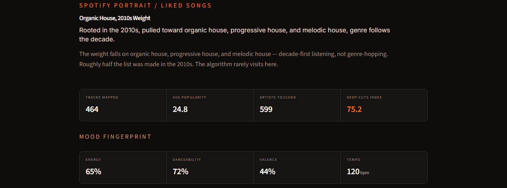
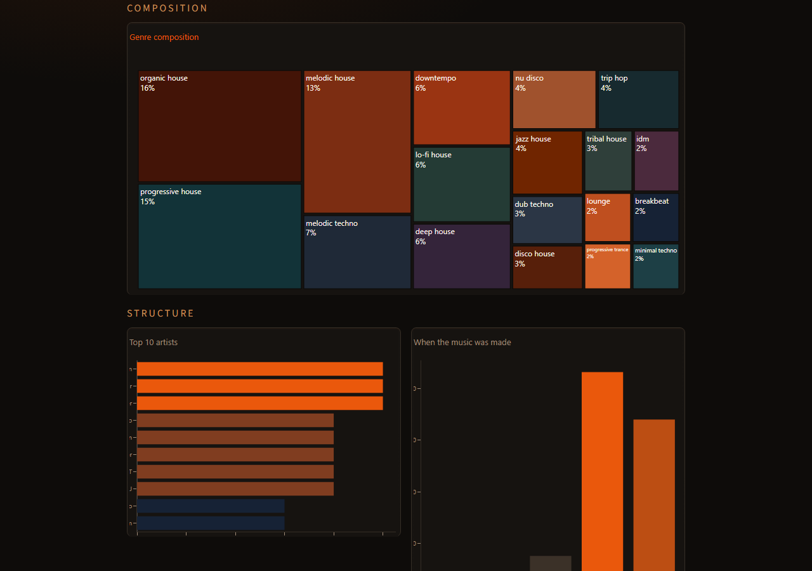
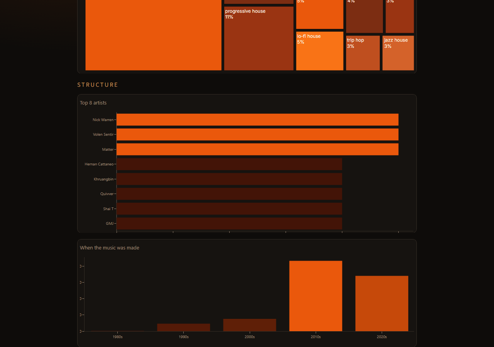

# Spotify Portrait

> Editorial listening portrait from your Spotify library.

**[Live demo](https://taste-map-jbjx3umnykyhbgutasmqr6.streamlit.app/)** · [Source on GitHub](https://github.com/jmshall93-debug/spotify-portrait)

Upload an [Exportify](https://exportify.net) CSV and get a one-page portrait of what you listen to - genre weight, release-era shape, artist concentration, and how deep your cuts run.



---

## Features

- Genre composition treemap
- Release-era histogram and top artists
- Mood fingerprint (energy, danceability, valence, tempo)
- Editorial headline and interpretation from your stats
- Playlist picker or CSV upload
- Optional AI portrait via Groq or local Ollama

---

## Example Dashboard

### Charts



### Full walkthrough



---

## Tech Stack

- Python
- Streamlit
- Plotly
- Pandas

---

## Architecture

```text
Spotify CSV
      |
      v
parse.py
      |
      v
Taste Profile
      |
      v
Narrative Generator
      |
      v
Streamlit Dashboard
```

---

## Running locally

```powershell
git clone https://github.com/jmshall93-debug/spotify-portrait.git
cd spotify-portrait
py -m venv .venv
.\.venv\Scripts\pip install -r requirements.txt
.\run.bat
```

Opens **http://localhost:8501** in your browser.

---

## Your data

Use an Exportify export with track name, artist, release date, popularity, and genres. Audio feature columns unlock the mood fingerprint. Bundled sample data is included; private exports stay local.
